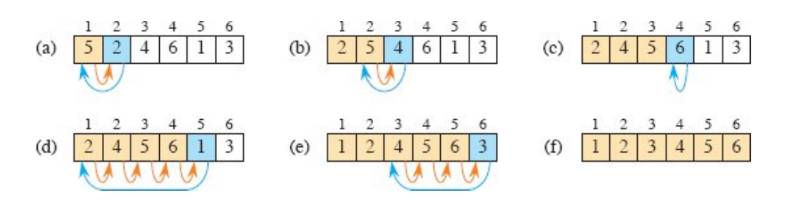

# Table of Contents
1. [Why was this repository created?](#why-was-this-repository-created?)
2. [Insertion sort](#insertion-sort)
    - [How it works](#how-it-works)


# Why was this repository created?

Hello everyone, 

"Introduction To Algorithm" is a good book that I am reading and am 
very excited about. Reading is not enough for me, so I want to note 
what I have read from the book. These orders will correspond with 
the contents of the book. The code in the book is written in 
pseudo-code, which makes the book available to everyone who wants to 
learn about algorithms. Also, the C programming language is quite old 
now, but I am very excited about C. That is why this repository was created to combine my learning of algorithms with my interest in C. However, reading about the 
fundamentals of a programming language without describing the algorithms 
is not enough. To understand more about a programming language, 
using it to write algorithms is a good way to learn more.


> [!NOTE]
> These are the list of common sorting algorithms implemented in C


## Insertion sort

```c
void insertion_sort(int *arr, int n) {
    for (int i = 1; i < n; i++) {
        int key = arr[i];
        int j = i - 1;
        while (j >= 0 && arr[j] > key) {
            arr[j + 1] = arr[j];
            j--;
        }
        arr[j + 1] = key;
    }
} 
```

### How it works? 

The image below is taken from the CLRS book.




